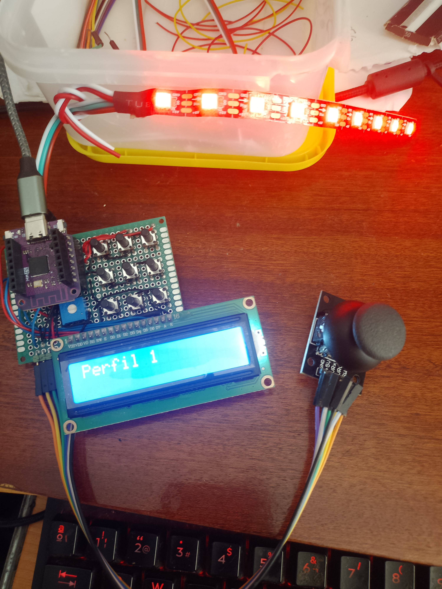

# ⌨ CircuitPython-Macro-Keyboard

Proyecto de fin de grado enfocado en el desarrollo de un teclado de macros programable utilizando **CircuitPython** y una placa **LOLIN S2 mini**.
Este sistema auxiliar a nuestros periféricos convencionales nos permite ejecutar combinaciones de teclas, comandos multimedia, así como cadenas de texto personalizadas

---
## 📷 Vista previa del dispositivo


---
## Características del dispositivo (actualmente)
- Diseño hardware completo para integrar todos lo componentes seleccionados (botones, joystick, LCD, LEDs), pudiendo modificar el diseño para integrar nuevos componentes.
- Manejo de múltiples perfiles configurables de macros.
- Configuración sencilla mediante archivo '.txt' habilitada para todo tipo de SO.

## Componentes utilizados
- **Placa**: LOLIN S2 Mini (ESP32-S2)
- **Pantalla**: LCD 16x2 sin I2C
- **Iluminación**: Tira LED Neopixel (9 LEDs)
- **Joystick analógico** con pulsador
- **Matrix de botones**: 3x3 (9 en total, redimensionable según necesidades)
- **Cable USB-C**: Alimentación del dispositivo y acceso al código en la placa

---

## ⚙️ Funcionalidades principales
- Retroiluminación por perfil, efectos de colores y pulsación resaltada.
- Manejo de perfiles mediante el joystick
- Visualización de información relevante en la pantalla LCD (información del perfil, macro ejecutada)
- Soporte para:
    - Combinaciones de teclas ('Keycode')
    - Controles multimedia ('ConsumerControl')
    - Textos personalizados ('Strings')
- Carga de perfiles desde '.txt' extensible
- Compatible con sistemas operativos que acepten dispositivos HID (Windows, Linux, macOS)

---

## 📁 Estructura del proyecto
```text
/Código/
│
├── code.py # Archivo principal de ejecución
├── lib/ # Librerías necesarias para CircuitPython
│ ├── adafruit_hid/
│ ├── adafruit_character_lcd/
│ ├── adafruit_bus_device/
│ ├── adafruit_register/
│ ├── neopixel.mpy
│ ├── rainbowio.mpy
│ └── _pixelbuf.mpy
├── perfiles.txt # Archivo de configuración de perfiles configurables adicionales
├── README.md # Este archivo
└── prototipo1.py y button_matrix.py # Estos son archivos relacionados con pruebas realizadas durante el desarrollo. No son necesarios para el funcionamiento del dispositivo

/EasyEDA/
│
├── Capturas # Carpeta con imágenes del diseño de la PCB personalizada para este dispositivo
├── CircuitPython Macro Keyboard # Carpeta que contiene el proyecto completo de EasyEDA
```

---

## 📋 Instalación y uso

1. Asegúrate de tener instalada la versión compatible de **CircuitPython** en tu placa.
2. Copia todos los archivos del proyecto en la memoria de la placa (Aparecerá en tu equipo como 'CIRCUITPY' si la instalación ha sido correcta)
3. Comprueba que las librerías necesarias están incluidas en '/lib'.
4. Reinicia la placa, o desconecta y vuelve a conectar la placa.
5. El dispositivo aparecerá como un dispositivo HID y se iniciará con el perfil activo de base.


## 🛠️ Configuración de nuevos perfiles

Puedes definir tus propios perfiles de macros editando el archivo `perfiles.txt`. Cada perfil de este dispositivo consta de la siguiente información:
- Nombre del perfil
- Color base (RGB)
- Color para identificar macro ejecutada
- 9 macros con formato:
    ```
    macro0 = "Nombre descriptivo macro", tipo_macro, TECLA1, TECLA2, ....
    ```
- Donde tipo_macro pertenece a uno de los siguiente: 
    - 'keys' -> combinaciones con 'Keycode'
    - 'consumer' -> controles multimedia
    - 'text' -> texto plano

📄 **Ejemplo**:
```
    [Perfil 1]
    name = Perfil 3: Multimedia
    color = 255,0,127
    highlight = 255,255,0
    macro0 = "Play",consumer,PLAY_PAUSE
    macro1 = "Vol +",consumer,VOLUME_INCREMENT
    macro2 = "Vol -",consumer,VOLUME_DECREMENT
```

💡 **Nota:**
Para la configuración de macros personalizadas recomiendo consultar la [**API Reference** de CircuitPython](https://docs.circuitpython.org/projects/hid/en/latest/api.html) donde se encuentran todos los códigos de cada tecla utilizable para la creación de las macros. Visitar concretamente las clases `Keycode` y `ConsumerControlCode`.

---

### Desarrollado como proyectode TFG por David Sousa González, utilizando CircuitPython y componentes Adafruit. Basado en la documentación oficial de [Adafruit](https://learn.adafruit.com/circuitpython-essentials), [CircuitPython](https://docs.circuitpython.org/en/latest/README.html) y proyectos similares de la comunidad
